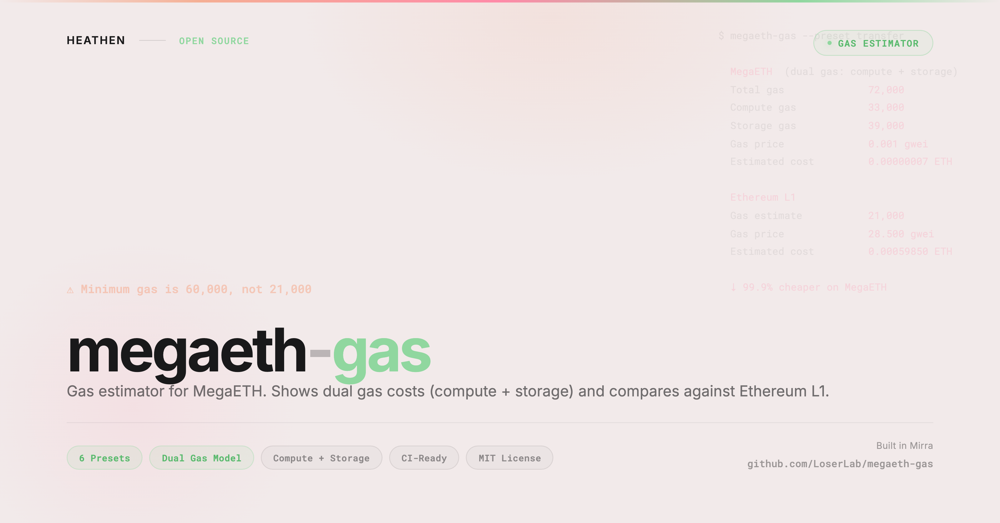

# megaeth-gas

<p align="center">
  
</p>

Gas estimator for [MegaETH](https://megaeth.systems). Shows dual gas costs (compute + storage) and compares MegaETH vs Ethereum L1.

> **Note:** MegaETH uses a dual gas model (compute + storage). The minimum gas per transaction is 60,000 (21k compute + 39k storage), not the standard 21,000 you expect from Ethereum.

## Install

```bash
npx megaeth-gas
```

Or install globally:

```bash
npm install -g megaeth-gas
megaeth-gas
```

## Why this exists

Gas on MegaETH works differently from standard EVM chains:

- **Dual gas dimensions.** Every transaction pays compute gas (21,000 intrinsic) plus storage gas (39,000 intrinsic). The minimum total is 60,000 gas, not 21,000.
- **Extremely low base fee.** MegaETH's base fee is 0.001 gwei, making transactions near-free in ETH terms.
- **10ms mini blocks.** MegaETH produces EVM blocks every ~1 second, but mini blocks every ~10ms, enabling real-time applications.
- **10 billion block gas limit.** Orders of magnitude higher throughput than Ethereum L1.

`megaeth-gas` estimates gas for common transaction types, shows the compute + storage breakdown, and compares costs against Ethereum L1.

## Usage

```bash
# Estimate gas for all common transaction types
npx megaeth-gas

# Estimate a specific preset
npx megaeth-gas -p transfer
npx megaeth-gas -p swap

# Custom transaction
npx megaeth-gas --to 0x... --data 0x...

# Set gas limit multiplier (lower = tighter estimate)
npx megaeth-gas --multiplier 1.1

# Include USD pricing
npx megaeth-gas --eth-price 2500

# JSON output (for CI/CD)
npx megaeth-gas --json

# Skip Ethereum comparison
npx megaeth-gas --no-compare

# Custom RPC
npx megaeth-gas --rpc https://your-rpc.com
```

## Presets

| Preset | Description |
|---|---|
| `transfer` | Simple ETH send |
| `erc20-transfer` | ERC-20 token transfer |
| `erc20-approve` | ERC-20 token approval |
| `swap` | DEX swap (Uniswap-style) |
| `nft-mint` | NFT mint (ERC-721) |
| `deploy` | Contract deployment |

## MegaETH Gas Model

MegaETH introduces a dual gas model with two dimensions:

```
total_gas = compute_gas + storage_gas
cost = total_gas x gas_price
```

### Compute Gas
Standard EVM execution cost. Intrinsic: 21,000 per transaction (same as Ethereum).

### Storage Gas
Additional cost for state modifications. Intrinsic: 39,000 per transaction. Storage-heavy operations (like zero-to-nonzero SSTORE) incur additional storage gas.

### Per-Transaction Resource Limits
- Compute: 200M gas
- Data: 12.5MB
- KV updates: 500K
- State growth: 1K slots

The `--multiplier` flag controls buffer above the estimate:

- `1.0` = exact estimate (risky, may fail)
- `1.1` = 10% buffer (tight)
- `1.2` = 20% buffer (default, safe)
- `1.5` = 50% buffer (generous)

## Programmatic API

```typescript
import { estimateGas, compareGas } from "megaeth-gas";

const estimate = await estimateGas(
  { to: "0x...", data: "0x..." },
  { megaethRpc: "https://mainnet.megaeth.com/rpc" }
);

console.log(estimate.totalGas);    // Total gas (compute + storage)
console.log(estimate.computeGas);  // Compute gas component
console.log(estimate.storageGas);  // Storage gas component
```

## Part of the MegaETH Developer Toolkit

| Tool | What it does |
|------|-------------|
| [megaeth-audit](https://github.com/LoserLab/megaeth-audit) | Catch EVM incompatibilities and dual gas model gotchas in your Solidity contracts |
| **megaeth-gas** (this tool) | Estimate gas costs on MegaETH vs Ethereum |

## License

MIT

---

Built for [megaeth.systems](https://megaeth.systems)
